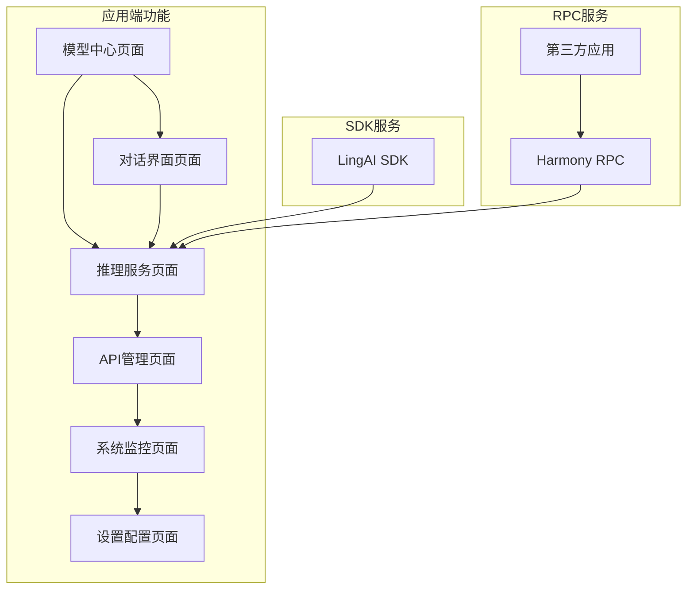

# 灵桥（LingAI Bridge）- 鸿蒙端侧AI模型桥接服务

## 1. 产品概述

灵桥（LingAI Bridge）是一个专为鸿蒙OS5/NEXT设计的端侧AI模型桥接服务，具有双重产品目标，旨在解决每个应用都需要重复实现AI模型下载、转换、推理的问题。

**产品双重目标：**

**目标一：鸿蒙AI桥接应用**
开发一款完整的鸿蒙OS5应用，支持从HuggingFace直接下载GGUF格式模型，提供本地推理运行能力和用户友好的对话界面，同时为其他注册应用提供统一的本地大模型服务接口。

**目标二：AI开发SDK套件**
提供一套封装完善的AI API SDK，包含常用AI功能的统一接口，支持各种大模型的本地推理运行，让鸿蒙开发团队可以直接引用集成，专注于业务开发而无需关心底层AI实现细节。

通过这种双重价值定位，灵桥将成为鸿蒙生态中AI能力的标准化中台服务，类似iOS生态中的PocketPal，既为终端用户提供强大的AI应用体验，又为开发者提供便捷的AI开发工具链。

## 2. 核心功能

### 2.1 用户角色

| 角色 | 注册方式 | 核心权限 |
|------|----------|----------|
| 普通用户 | 应用安装后自动激活 | 可下载和使用免费模型，基础推理服务，使用对话界面 |
| SDK开发者 | SDK集成+API Key认证 | 可集成LingAI SDK，调用完整API接口，访问高级模型功能 |
| 应用开发者 | 应用注册+权限申请 | 可通过RPC调用灵桥服务，获取推理结果，查看调用统计 |
| 系统管理员 | 设备管理员权限 | 可管理所有模型，监控系统资源，配置安全策略，管理开发者权限 |

### 2.2 功能模块

**应用端功能模块：**
1. **模型中心页面**：HuggingFace模型浏览、搜索、GGUF格式下载管理。
2. **对话界面页面**：本地模型聊天、多轮对话、历史记录管理。
3. **推理服务页面**：模型加载、推理测试、性能监控。
4. **API管理页面**：注册应用管理、接口权限、调用统计。
5. **系统监控页面**：资源使用、日志查看、性能分析。
6. **设置配置页面**：系统配置、用户管理、安全设置。

**SDK功能模块：**
1. **模型管理SDK**：模型下载、加载、卸载的统一接口。
2. **推理引擎SDK**：文本生成、对话、嵌入向量等推理功能。
3. **工具调用SDK**：Function Calling、RAG检索等高级功能。
4. **资源管理SDK**：内存管理、GPU调度、性能优化。
5. **配置管理SDK**：参数设置、模型切换、环境配置。

### 2.3 页面详情

| 页面名称 | 模块名称 | 功能描述 |
|----------|----------|----------|
| 模型中心页面 | HuggingFace浏览器 | 连接HuggingFace Hub，展示GGUF格式模型列表，支持按类型、大小筛选 |
| 模型中心页面 | 下载管理器 | 管理GGUF模型下载进度，支持断点续传和批量下载 |
| 模型中心页面 | 本地模型库 | 管理已下载模型，支持模型信息查看、删除和更新 |
| 对话界面页面 | 聊天界面 | 提供用户友好的对话界面，支持多轮对话和上下文记忆 |
| 对话界面页面 | 历史记录 | 保存和管理对话历史，支持搜索和导出功能 |
| 对话界面页面 | 模型切换 | 支持在对话中快速切换不同的本地模型 |
| 推理服务页面 | 推理引擎 | 基于llama.cpp的统一推理接口，支持文本生成和对话 |
| 推理服务页面 | 性能监控 | 实时监控推理性能，包括延迟、吞吐量、资源使用 |
| 推理服务页面 | 模型测试 | 提供模型推理测试工具，验证模型性能和准确性 |
| API管理页面 | 应用注册 | 管理注册的第三方应用，分配API权限和调用配额 |
| API管理页面 | 接口文档 | 提供完整的RPC接口文档和SDK使用示例 |
| API管理页面 | 调用统计 | 统计各应用API调用次数、成功率、响应时间等指标 |
| 系统监控页面 | 资源监控 | 监控CPU、内存、GPU等系统资源使用情况 |
| 系统监控页面 | 模型管理 | 管理已加载模型的内存占用和运行状态 |
| 系统监控页面 | 日志系统 | 记录和查看系统运行日志，支持错误诊断和性能分析 |
| 设置配置页面 | 系统配置 | 配置推理参数、并发数、缓存策略等系统参数 |
| 设置配置页面 | 安全设置 | 配置应用访问控制、API权限等安全策略 |
| 设置配置页面 | 存储管理 | 管理本地存储空间，清理模型缓存和临时文件 |

## 3. 核心流程

**普通用户流程：**
用户安装灵桥应用后，可以浏览HuggingFace模型库，下载GGUF格式模型到本地，通过对话界面与AI模型进行交互，享受流畅的本地AI对话体验。

**SDK开发者流程：**
开发者在项目中集成LingAI SDK，通过简单的API调用即可使用文本生成、对话、嵌入向量等AI功能，SDK自动处理模型管理和推理优化，让开发者专注于业务逻辑开发。

**应用开发者流程：**
第三方应用开发者通过应用注册获得API权限，使用Harmony RPC接口调用灵桥的AI服务，获取推理结果，无需在自己的应用中集成复杂的AI模型。

**系统管理员流程：**
系统管理员可以监控整个系统的运行状态，管理本地模型库，配置应用访问权限和安全策略，确保系统稳定高效运行。



## 4. 用户界面设计

### 4.1 设计风格

- **主色调**：科技蓝 (#2196F3) 和深空灰 (#263238)，体现AI科技感
- **辅助色**：成功绿 (#4CAF50)、警告橙 (#FF9800)、错误红 (#F44336)
- **按钮样式**：圆角矩形按钮，支持悬浮效果和点击反馈
- **字体**：HarmonyOS Sans，标题18-24px，正文14-16px，说明文字12px
- **布局风格**：卡片式设计，顶部导航栏，左侧功能菜单，主内容区域
- **图标风格**：线性图标配合填充图标，统一使用Material Design图标库

### 4.2 页面设计概览

| 页面名称 | 模块名称 | UI元素 |
|----------|----------|---------|
| 模型中心页面 | HuggingFace浏览器 | 网格布局的GGUF模型卡片，显示模型图标、名称、大小、GGUF标签，支持搜索框和类型筛选 |
| 模型中心页面 | 下载管理器 | 列表形式显示下载任务，包含进度条、下载速度、剩余时间，支持暂停/恢复按钮 |
| 对话界面页面 | 聊天界面 | 类似微信的对话气泡设计，用户消息右对齐蓝色，AI回复左对齐灰色，底部输入框和发送按钮 |
| 对话界面页面 | 历史记录 | 时间线式对话列表，显示对话标题、时间戳、模型名称，支持搜索和批量删除 |
| 推理服务页面 | 推理引擎 | 输入输出区域，模型选择下拉框，推理参数滑块，实时显示推理状态和耗时 |
| 推理服务页面 | 性能监控 | 仪表盘样式，使用图表展示实时性能数据，包含GPU使用率环形图、内存使用柱状图 |
| API管理页面 | 应用注册 | 应用列表卡片，注册表单弹窗，权限开关组件，配额进度条显示 |
| API管理页面 | 接口文档 | 左侧API目录树，右侧文档内容，支持代码高亮、复制功能和SDK示例 |
| 系统监控页面 | 资源监控 | 多个监控卡片，实时更新数据，使用渐变色背景和动画效果，GPU温度显示 |
| 设置配置页面 | 系统配置 | 分组的设置项，推理参数滑块，并发数输入框，缓存策略选择器，简洁明了的布局 |

### 4.3 响应式设计

产品主要面向鸿蒙手机和平板设备，采用移动优先的响应式设计。支持横竖屏切换，针对平板设备优化多列布局，支持触摸手势操作如滑动、长按等。

## 5. 界面设计方案

### 5.1 设计理念

**简洁直观**
- 清晰的导航结构，减少用户认知负担
- 扁平化设计语言，符合现代移动应用审美
- 信息层次分明，重要功能突出显示

**对话优先**
- 以聊天界面为核心，提供自然的交互体验
- 类似微信的对话气泡设计，用户习惯友好
- 支持多模态输入输出，包括文本、语音、图片

**模型管理**
- 直观的模型下载、加载和切换功能
- 可视化的模型状态和性能指标
- 智能的存储空间管理和优化建议

**性能可视化**
- 实时显示推理性能指标
- 直观的资源使用情况展示
- 性能趋势分析和优化建议

**HarmonyOS原生**
- 遵循HarmonyOS设计语言和交互规范
- 深度集成系统特性，如分布式能力
- 支持原子化服务和桌面小组件

### 5.2 主界面架构

#### 5.2.1 底部导航栏设计

```
┌─────────────────────────────────────────────────────────┐
│                    顶部状态栏                            │
├─────────────────────────────────────────────────────────┤
│                                                         │
│                   主内容区域                             │
│                                                         │
├─────────────────────────────────────────────────────────┤
│  💬聊天   📦模型   📊监控   ⚙️设置                      │
└─────────────────────────────────────────────────────────┘
```

**四个主要模块：**
- **聊天**：对话界面，支持多个会话管理
- **模型**：模型中心，下载和管理GGUF模型
- **监控**：性能监控，系统状态和API服务状态
- **设置**：系统配置，用户设置和开发者选项

#### 5.2.2 聊天界面布局

```
┌─────────────────────────────────────────────────────────┐
│ ← 返回  当前模型：Qwen2-7B-Chat  🔄切换  ⚡性能         │
├─────────────────────────────────────────────────────────┤
│                                                         │
│  AI: 你好！我是Qwen2，有什么可以帮助你的吗？              │
│                                                         │
│                              用户: 介绍一下你自己 💬     │
│                                                         │
│  AI: 我是通义千问2，一个大型语言模型...                   │
│                                                         │
│                              用户: 你能做什么？ 💬       │
│                                                         │
│  AI: 我可以帮助你进行对话、回答问题、创作内容...           │
│                                                         │
├─────────────────────────────────────────────────────────┤
│ 📎  ┌─────────────────────────────────┐  🎤  📤        │
│     │ 输入你的问题...                  │                │
│     └─────────────────────────────────┘                │
└─────────────────────────────────────────────────────────┘
```

**顶部工具栏包含：**
- 返回按钮和页面标题
- 当前使用模型显示
- 快速模型切换按钮
- 实时性能指标（推理速度、内存使用）

**对话区域特点：**
- 用户消息右对齐，蓝色气泡
- AI回复左对齐，灰色气泡
- 支持消息长按操作（复制、重新生成、删除）
- 自动滚动到最新消息

**输入区域功能：**
- 多行文本输入框，支持自动扩展
- 附件按钮（图片、文档上传）
- 语音输入按钮
- 发送按钮，支持快捷键

#### 5.2.3 模型管理界面

```
┌─────────────────────────────────────────────────────────┐
│ 🔍 搜索模型...        🔽类型筛选  📊大小排序             │
├─────────────────────────────────────────────────────────┤
│ 📥 正在下载 (2)                                         │
│ ┌─────────────────────────────────────────────────────┐ │
│ │ Qwen2-7B-Chat-GGUF    ████████░░ 80%  2.1GB/2.6GB │ │
│ │ 下载速度: 15.2MB/s    剩余时间: 2分钟               │ │
│ └─────────────────────────────────────────────────────┘ │
│                                                         │
│ 💾 本地模型 (5)                                         │
│ ┌─────────────────────────────────────────────────────┐ │
│ │ 🤖 Qwen2-7B-Chat      ✅已加载    2.6GB    🗑️      │ │
│ │ 📝 对话模型 | 中英文 | 7B参数                       │ │
│ └─────────────────────────────────────────────────────┘ │
│ ┌─────────────────────────────────────────────────────┐ │
│ │ 🤖 Llama3-8B-Instruct  ⏸️待机    3.1GB    🗑️      │ │
│ │ 📝 指令模型 | 多语言 | 8B参数                       │ │
│ └─────────────────────────────────────────────────────┘ │
│                                                         │
│ 🌐 HuggingFace模型库                                   │
│ ┌─────────────────────────────────────────────────────┐ │
│ │ 🤖 Phi-3-Mini-GGUF     ⬇️下载    1.8GB    ⭐4.5   │ │
│ │ 📝 轻量级模型 | 多语言 | 3.8B参数                   │ │
│ └─────────────────────────────────────────────────────┘ │
└─────────────────────────────────────────────────────────┘
```

**搜索筛选功能：**
- 模型名称搜索
- 按类型筛选（对话、代码、嵌入等）
- 按大小排序（从小到大、从大到小）
- 按评分排序

**模型卡片信息：**
- 模型图标和名称
- 运行状态（已加载、待机、下载中）
- 文件大小和参数量
- 模型类型和支持语言
- 操作按钮（下载、删除、详情）

#### 5.2.4 性能监控界面

```
┌─────────────────────────────────────────────────────────┐
│ 📊 系统状态                                             │
│ ┌─────────────────────────────────────────────────────┐ │
│ │ 🖥️ CPU使用率     ████████░░ 78%                     │ │
│ │ 💾 内存使用      ██████░░░░ 65%  5.2GB/8GB          │ │
│ │ 🎮 GPU使用率     ███░░░░░░░ 32%                     │ │
│ │ 🌡️ 设备温度      42°C (正常)                        │ │
│ └─────────────────────────────────────────────────────┘ │
│                                                         │
│ 🚀 推理性能                                             │
│ ┌─────────────────────────────────────────────────────┐ │
│ │ ⚡ 推理速度      15.2 tokens/s                      │ │
│ │ ⏱️ 响应延迟      245ms                              │ │
│ │ 📈 吞吐量        1,248 tokens/min                   │ │
│ │ 🎯 准确率        94.7%                              │ │
│ └─────────────────────────────────────────────────────┘ │
│                                                         │
│ 🔗 API服务状态                                          │
│ ┌─────────────────────────────────────────────────────┐ │
│ │ 📱 已注册应用    12个                               │ │
│ │ 📊 今日调用      2,847次                            │ │
│ │ ✅ 成功率        99.2%                              │ │
│ │ ⏰ 平均响应      180ms                              │ │
│ └─────────────────────────────────────────────────────┘ │
└─────────────────────────────────────────────────────────┘
```

**实时状态卡片：**
- 系统资源使用情况（CPU、内存、GPU、温度）
- 推理性能指标（速度、延迟、吞吐量、准确率）
- API服务统计（注册应用数、调用次数、成功率）

#### 5.2.5 设置界面

```
┌─────────────────────────────────────────────────────────┐
│ ⚙️ 设置                                                 │
│                                                         │
│ 🎨 界面设置                                             │
│ ┌─────────────────────────────────────────────────────┐ │
│ │ 🌙 深色模式      [开关]                             │ │
│ │ 🔤 字体大小      ●──────○ 中等                      │ │
│ │ 🎭 主题色彩      🔵蓝色 ⚪灰色 🟢绿色               │ │
│ └─────────────────────────────────────────────────────┘ │
│                                                         │
│ 🤖 模型设置                                             │
│ ┌─────────────────────────────────────────────────────┐ │
│ │ 🎯 默认模型      Qwen2-7B-Chat ▼                    │ │
│ │ 🔥 推理温度      ●────○ 0.7                         │ │
│ │ 📏 最大长度      ●──────○ 2048                      │ │
│ │ 🧠 上下文窗口    ●────○ 4096                        │ │
│ └─────────────────────────────────────────────────────┘ │
│                                                         │
│ 🔗 API设置                                              │
│ ┌─────────────────────────────────────────────────────┐ │
│ │ 🔑 API密钥管理   [管理]                             │ │
│ │ 🚦 并发限制      ●──○ 5个                           │ │
│ │ ⏱️ 超时设置      ●────○ 30秒                        │ │
│ └─────────────────────────────────────────────────────┘ │
│                                                         │
│ 🛡️ 系统设置                                             │
│ ┌─────────────────────────────────────────────────────┐ │
│ │ 💾 存储管理      [清理缓存]                         │ │
│ │ 🔒 安全设置      [权限管理]                         │ │
│ │ 📋 日志导出      [导出日志]                         │ │
│ │ ℹ️ 关于应用      版本 1.0.0                         │ │
│ └─────────────────────────────────────────────────────┘ │
└─────────────────────────────────────────────────────────┘
```

**分组设置项：**
- **界面设置**：深色模式、字体大小、主题色彩
- **模型设置**：默认模型、推理参数、上下文配置
- **API设置**：密钥管理、并发限制、超时配置
- **系统设置**：存储管理、安全设置、日志导出

### 5.3 特色功能界面

#### 5.3.1 模型快速切换

```
长按模型名称弹出切换菜单：
┌─────────────────────────────────┐
│ 🔄 切换模型                      │
├─────────────────────────────────┤
│ ✅ Qwen2-7B-Chat    (当前)      │
│ 🤖 Llama3-8B-Instruct          │
│ 🤖 Phi-3-Mini                  │
│ 🤖 CodeLlama-7B                │
├─────────────────────────────────┤
│ ➕ 加载更多模型                  │
└─────────────────────────────────┘
```

#### 5.3.2 对话管理

```
┌─────────────────────────────────────────────────────────┐
│ 💬 对话列表                                             │
│ ┌─────────────────────────────────────────────────────┐ │
│ │ 📝 关于AI的讨论                    今天 14:32       │ │
│ │ 🤖 Qwen2-7B-Chat | 15条消息                        │ │
│ └─────────────────────────────────────────────────────┘ │
│ ┌─────────────────────────────────────────────────────┐ │
│ │ 💻 代码编程助手                    昨天 09:15       │ │
│ │ 🤖 CodeLlama-7B | 8条消息                          │ │
│ └─────────────────────────────────────────────────────┘ │
│ ┌─────────────────────────────────────────────────────┐ │
│ │ 📚 学习计划制定                    3天前            │ │
│ │ 🤖 Llama3-8B | 23条消息                            │ │
│ └─────────────────────────────────────────────────────┘ │
│                                                         │
│                                              ➕ 新对话  │
└─────────────────────────────────────────────────────────┘
```

#### 5.3.3 模型下载进度

```
┌─────────────────────────────────────────────────────────┐
│ 📥 下载中心                                             │
│ ┌─────────────────────────────────────────────────────┐ │
│ │ 🤖 Qwen2-7B-Chat-GGUF                              │ │
│ │ ████████████████████████░░░░░░ 80%                  │ │
│ │ 2.1GB / 2.6GB                                      │ │
│ │ 📶 15.2MB/s  ⏱️ 2分钟剩余  ⏸️暂停  ❌取消          │ │
│ └─────────────────────────────────────────────────────┘ │
│ ┌─────────────────────────────────────────────────────┐ │
│ │ 🤖 Phi-3-Mini-GGUF                                 │ │
│ │ ████████████████████████████████████████ 100%      │ │
│ │ 1.8GB / 1.8GB                                      │ │
│ │ ✅ 下载完成  🚀 立即加载                            │ │
│ └─────────────────────────────────────────────────────┘ │
└─────────────────────────────────────────────────────────┘
```

### 5.4 交互设计细节

#### 5.4.1 微动画效果

**消息发送动画：**
- 消息气泡从输入框滑动到对话区域
- 发送按钮旋转动画表示正在处理
- AI回复时显示"正在思考"的呼吸灯效果

**模型加载呼吸灯：**
- 模型图标周围的光环呼吸效果
- 加载进度的渐变色动画
- 加载完成时的成功提示动画

**性能指标变化动画：**
- 数值变化时的数字滚动效果
- 进度条的平滑过渡动画
- 图表数据的实时更新动画

#### 5.4.2 手势操作

**左滑删除：**
- 对话列表项左滑显示删除按钮
- 模型列表项左滑显示删除和详情按钮
- 下载任务左滑显示暂停和取消按钮

**长按复制：**
- 消息长按弹出操作菜单（复制、重新生成、删除）
- 模型名称长按弹出快速切换菜单
- 性能数据长按复制到剪贴板

**双击重新生成：**
- 双击AI回复消息重新生成回答
- 双击模型卡片快速加载/卸载
- 双击性能图表切换显示模式

**下拉刷新：**
- 对话界面下拉刷新对话历史
- 模型列表下拉刷新HuggingFace模型库
- 监控界面下拉刷新性能数据

#### 5.4.3 状态反馈

**加载指示器：**
- 骨架屏显示内容加载状态
- 旋转加载器表示网络请求
- 进度条显示文件下载进度

**网络状态提示：**
- 顶部横幅显示网络连接状态
- 离线模式提示和功能限制说明
- 网络恢复时的自动重连提示

**错误信息展示：**
- Toast提示显示操作结果
- 错误页面显示详细错误信息和解决建议
- 表单验证错误的实时提示

### 5.5 HarmonyOS特性适配

#### 5.5.1 原子化服务卡片

**桌面小组件设计：**
```
┌─────────────────────────────────┐
│ 🤖 LingAI Bridge                │
│ ┌─────────────────────────────┐ │
│ │ 当前模型: Qwen2-7B-Chat     │ │
│ │ 状态: ✅运行中              │ │
│ │ 内存: 2.1GB/8GB            │ │
│ │ 速度: 15.2 tokens/s        │ │
│ └─────────────────────────────┘ │
│ [💬快速对话] [📊性能监控]       │
└─────────────────────────────────┘
```

**卡片功能：**
- 显示当前加载模型和运行状态
- 实时显示性能指标
- 快速启动对话和监控功能
- 支持4x2和2x2两种尺寸

#### 5.5.2 分布式能力

**多设备协同：**
- 手机和平板之间的对话同步
- 模型在不同设备间的分布式存储
- 推理任务的设备间负载均衡

**对话同步：**
- 实时同步对话历史到云端
- 跨设备的对话状态保持
- 离线对话的自动同步机制

**模型分布式存储：**
- 大模型在多设备间分片存储
- 智能的模型缓存策略
- 设备间的模型共享机制

#### 5.5.3 系统集成

**语音助手调用：**
- "小艺小艺，打开LingAI对话"
- 语音直接发起AI对话
- 语音控制模型切换和设置

**通知系统：**
- 模型下载完成通知
- 系统资源警告通知
- API调用异常通知

**无障碍规范：**
- 支持屏幕阅读器
- 高对比度模式适配
- 大字体模式支持
- 语音输入和输出优化

### 5.6 开发者SDK界面

#### 5.6.1 开发者控制台

```
┌─────────────────────────────────────────────────────────┐
│ 👨‍💻 开发者控制台                                         │
│                                                         │
│ 📱 已注册应用                                           │
│ ┌─────────────────────────────────────────────────────┐ │
│ │ 📱 智能写作助手                                     │ │
│ │ 🔑 API Key: sk-ling***************                  │ │
│ │ 📊 今日调用: 1,247次 | 配额: 10,000次/天           │ │
│ │ ✅ 状态: 正常 | 📈 成功率: 99.2%                   │ │
│ │ [📋复制密钥] [📊详细统计] [⚙️设置]                  │ │
│ └─────────────────────────────────────────────────────┘ │
│                                                         │
│ 📊 API使用统计                                          │
│ ┌─────────────────────────────────────────────────────┐ │
│ │ 📈 调用趋势图 (最近7天)                             │ │
│ │     ▄▆█▅▇▄▃                                        │ │
│ │ 1000 ┤                                              │ │
│ │  500 ┤     █                                       │ │
│ │    0 └─────┴─────┴─────┴─────┴─────┴─────┴─────     │ │
│ │      1/15  1/16  1/17  1/18  1/19  1/20  1/21      │ │
│ └─────────────────────────────────────────────────────┘ │
│                                                         │
│ 🔧 SDK集成指南                                          │
│ ┌─────────────────────────────────────────────────────┐ │
│ │ 📚 快速开始                                         │ │
│ │ 📖 API文档                                          │ │
│ │ 💻 代码示例                                         │ │
│ │ 🐛 问题反馈                                         │ │
│ └─────────────────────────────────────────────────────┘ │
│                                                         │
│                                          [➕ 注册新应用] │
└─────────────────────────────────────────────────────────┘
```

**开发者功能：**
- 应用注册和API密钥管理
- 实时调用统计和配额监控
- 详细的使用分析和趋势图表
- 完整的SDK文档和代码示例
- 问题反馈和技术支持渠道

这套界面设计方案参考了PocketPal的成功经验，结合现代移动端AI应用的最佳实践，为HarmonyOS平台量身定制。设计注重功能完整性和用户体验流畅性，确保既能满足普通用户的AI对话需求，又能为开发者提供强大的SDK集成能力。