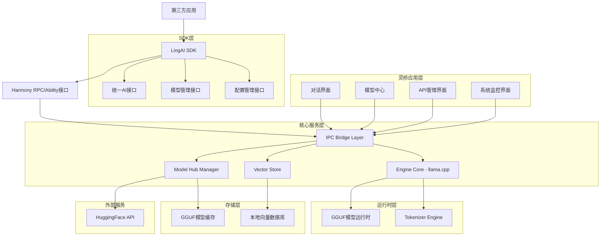
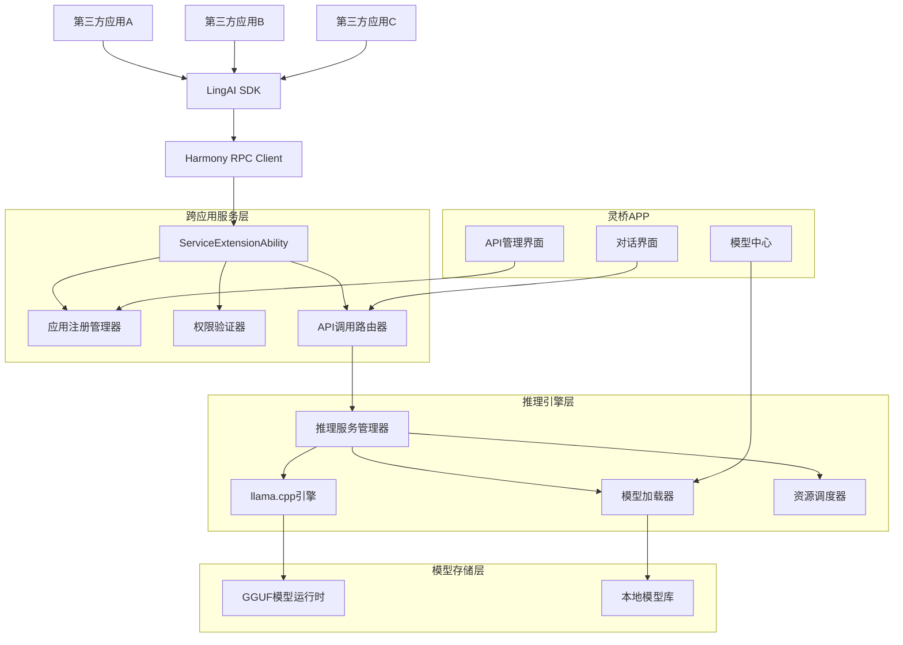
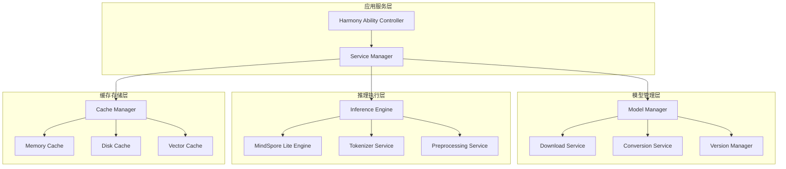
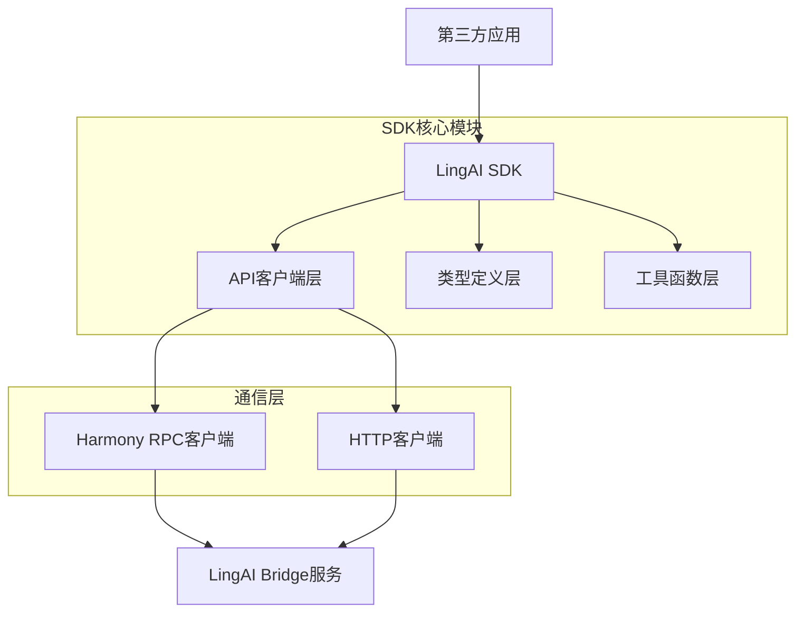
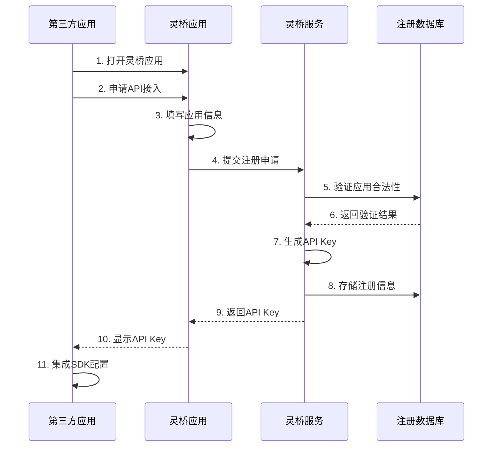
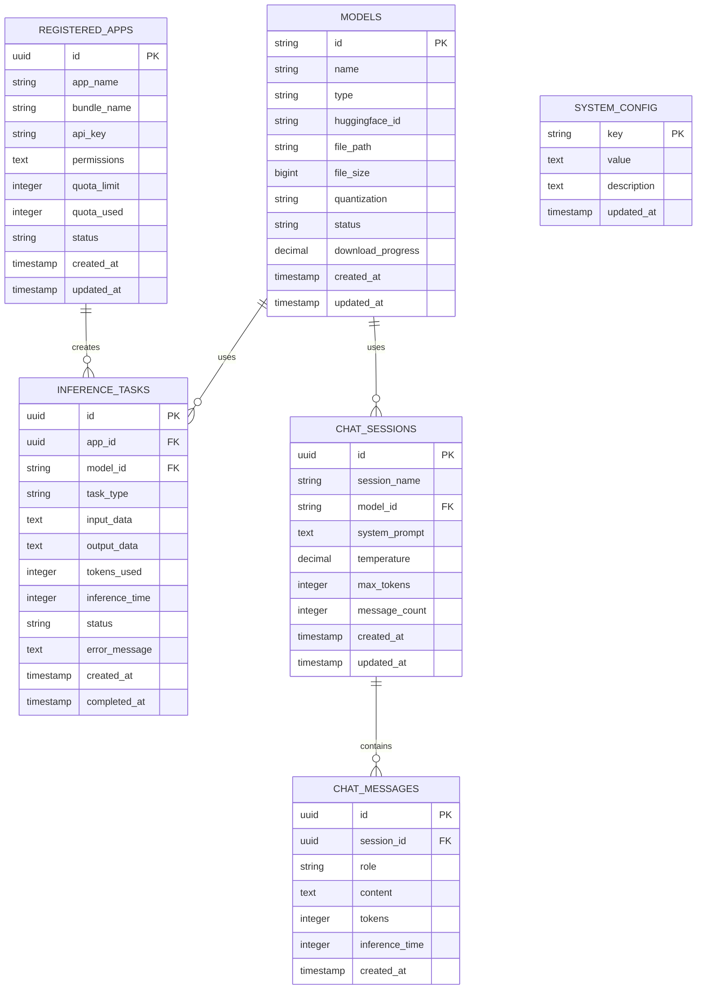

# 灵桥（LingAI Bridge）- 技术架构文档

## 1. 架构设计



## 2. 核心目标技术实现

### 2.1 双重产品目标

**目标1：灵桥APP开发**
- **鸿蒙OS5+应用**：基于ArkTS + ArkUI原生开发框架
- **HuggingFace集成**：直接从HuggingFace Hub下载GGUF格式模型
- **本地推理引擎**：集成llama.cpp实现高效本地推理
- **对话界面**：提供用户友好的聊天界面
- **跨应用服务**：通过ServiceExtensionAbility为其他APP提供AI服务

**目标2：AI API SDK提供**
- **统一API接口**：封装常用AI功能（对话、嵌入、工具调用等）
- **多模型支持**：兼容各种GGUF格式的大模型
- **开发者友好**：提供TypeScript/ArkTS SDK，简化集成
- **业务聚焦**：开发者无需关心模型管理和推理细节

### 2.2 技术栈描述

- **前端应用**: ArkTS + ArkUI，基于鸿蒙OS5/NEXT原生开发框架
- **SDK封装**: TypeScript/ArkTS，提供统一的AI能力接口
- **核心引擎**: llama.cpp + GGUF格式，专为LLM优化的推理引擎
- **IPC通信**: Harmony Ability + RPC机制，提供跨应用服务调用
- **模型格式**: GGUF (GPT-Generated Unified Format)，直接支持HuggingFace模型
- **模型管理**: 自研Model Hub + HuggingFace API集成，支持GGUF格式
- **存储**: 鸿蒙分布式数据管理 + SQLite本地缓存
- **网络**: 鸿蒙HTTP客户端 + 断点续传支持

## 3. 跨应用服务架构设计

### 3.1 HarmonyOS跨应用服务架构



### 3.2 ServiceExtensionAbility实现机制

**服务声明配置**
```json
// module.json5
{
  "module": {
    "extensionAbilities": [
      {
        "name": "LingAIBridgeService",
        "srcEntry": "./ets/ServiceExtAbility/LingAIBridgeService.ts",
        "type": "service",
        "exported": true,
        "permissions": [
          "ohos.permission.KEEP_BACKGROUND_RUNNING"
        ]
      }
    ]
  }
}
```

**服务实现代码**
```typescript
// LingAIBridgeService.ts
import ServiceExtensionAbility from '@ohos.app.ability.ServiceExtensionAbility';
import Want from '@ohos.app.ability.Want';
import rpc from '@ohos.rpc';

export default class LingAIBridgeService extends ServiceExtensionAbility {
  private inferenceEngine: InferenceEngine;
  private appRegistry: AppRegistry;
  
  onCreate(want: Want): void {
    console.info('LingAI Bridge Service onCreate');
    this.inferenceEngine = new InferenceEngine();
    this.appRegistry = new AppRegistry();
  }
  
  onConnect(want: Want): rpc.RemoteObject {
    console.info('LingAI Bridge Service onConnect');
    return new LingAIBridgeStub();
  }
  
  onDisconnect(want: Want): void {
    console.info('LingAI Bridge Service onDisconnect');
  }
  
  onDestroy(): void {
    console.info('LingAI Bridge Service onDestroy');
    this.inferenceEngine.cleanup();
  }
}
```

### 3.3 应用注册与认证体系

**注册流程设计**
```typescript
interface AppRegistration {
  appName: string;           // 应用名称
  bundleName: string;        // 应用包名
  developerInfo: {
    name: string;            // 开发者姓名
    email: string;           // 开发者邮箱
    organization?: string;   // 开发者组织
  };
  requestedPermissions: Permission[]; // 请求的权限列表
  quotaLimit: number;        // 请求的配额限制
}

interface Permission {
  type: 'chat' | 'embedding' | 'model_management' | 'advanced';
  models: string[];          // 允许使用的模型列表
  rateLimit: number;         // 调用频率限制
}
```

**API Key生成与管理**
```typescript
class APIKeyManager {
  // 生成API Key
  generateAPIKey(appId: string): string {
    const timestamp = Date.now();
    const random = Math.random().toString(36).substring(2);
    const signature = this.generateSignature(appId, timestamp);
    return `sk-ling-${appId}-${timestamp}-${random}-${signature}`;
  }
  
  // 验证API Key
  validateAPIKey(apiKey: string): ValidationResult {
    const parts = apiKey.split('-');
    if (parts.length !== 6 || parts[0] !== 'sk' || parts[1] !== 'ling') {
      return { valid: false, error: 'Invalid API key format' };
    }
    
    const [, , appId, timestamp, random, signature] = parts;
    const expectedSignature = this.generateSignature(appId, parseInt(timestamp));
    
    if (signature !== expectedSignature) {
      return { valid: false, error: 'Invalid signature' };
    }
    
    return { valid: true, appId, timestamp: parseInt(timestamp) };
  }
}
```

### 3.4 RPC通信协议设计

**RPC接口定义**
```typescript
// LingAIBridgeInterface.ts
interface ILingAIBridge {
  // 聊天对话接口
  chatCompletion(request: ChatCompletionRequest): Promise<ChatCompletionResponse>;
  
  // 流式聊天接口
  chatCompletionStream(request: ChatCompletionRequest): AsyncIterator<ChatCompletionChunk>;
  
  // 文本嵌入接口
  createEmbedding(request: EmbeddingRequest): Promise<EmbeddingResponse>;
  
  // 模型管理接口
  listModels(): Promise<ModelInfo[]>;
  loadModel(modelId: string): Promise<boolean>;
  unloadModel(modelId: string): Promise<boolean>;
  
  // 应用管理接口
  registerApp(registration: AppRegistration): Promise<RegistrationResult>;
  getAppQuota(apiKey: string): Promise<QuotaInfo>;
}
```

**RPC Stub实现**
```typescript
// LingAIBridgeStub.ts
import rpc from '@ohos.rpc';

export class LingAIBridgeStub extends rpc.RemoteObject implements ILingAIBridge {
  constructor() {
    super('LingAIBridge');
  }
  
  async onRemoteMessageRequest(code: number, data: rpc.MessageSequence, reply: rpc.MessageSequence): Promise<boolean> {
    console.info('LingAI Bridge onRemoteMessageRequest, code: ' + code);
    
    try {
      switch (code) {
        case MessageCode.CHAT_COMPLETION:
          return await this.handleChatCompletion(data, reply);
        case MessageCode.CREATE_EMBEDDING:
          return await this.handleCreateEmbedding(data, reply);
        case MessageCode.LIST_MODELS:
          return await this.handleListModels(data, reply);
        case MessageCode.REGISTER_APP:
          return await this.handleRegisterApp(data, reply);
        default:
          console.error('Unknown message code: ' + code);
          return false;
      }
    } catch (error) {
      console.error('RPC call failed:', error);
      reply.writeString(JSON.stringify({ error: error.message }));
      return false;
    }
  }
  
  private async handleChatCompletion(data: rpc.MessageSequence, reply: rpc.MessageSequence): Promise<boolean> {
    const apiKey = data.readString();
    const requestJson = data.readString();
    
    // 验证API Key
    const validation = this.apiKeyManager.validateAPIKey(apiKey);
    if (!validation.valid) {
      reply.writeString(JSON.stringify({ error: 'Invalid API key' }));
      return false;
    }
    
    // 检查配额
    const quotaCheck = await this.quotaManager.checkQuota(validation.appId);
    if (!quotaCheck.allowed) {
      reply.writeString(JSON.stringify({ error: 'Quota exceeded' }));
      return false;
    }
    
    // 执行推理
    const request: ChatCompletionRequest = JSON.parse(requestJson);
    const response = await this.inferenceEngine.chatCompletion(request);
    
    // 更新配额
    await this.quotaManager.updateUsage(validation.appId, response.usage.total_tokens);
    
    reply.writeString(JSON.stringify(response));
    return true;
  }
}
```

### 3.5 模型共享与资源管理

**模型共享机制**
```typescript
class ModelManager {
  private loadedModels: Map<string, LoadedModel> = new Map();
  private modelUsage: Map<string, Set<string>> = new Map(); // modelId -> appIds
  
  async loadModel(modelId: string, appId: string): Promise<boolean> {
    // 检查模型是否已加载
    if (this.loadedModels.has(modelId)) {
      // 添加应用到使用列表
      if (!this.modelUsage.has(modelId)) {
        this.modelUsage.set(modelId, new Set());
      }
      this.modelUsage.get(modelId)!.add(appId);
      return true;
    }
    
    // 检查内存是否足够
    const modelInfo = await this.getModelInfo(modelId);
    const availableMemory = await this.getAvailableMemory();
    
    if (modelInfo.memoryRequired > availableMemory) {
      // 尝试卸载不常用的模型
      await this.evictLeastUsedModel(modelInfo.memoryRequired);
    }
    
    // 加载模型
    const loadedModel = await this.llamaCppEngine.loadModel(modelInfo.filePath);
    this.loadedModels.set(modelId, loadedModel);
    
    // 记录使用情况
    this.modelUsage.set(modelId, new Set([appId]));
    
    return true;
  }
  
  async unloadModel(modelId: string, appId: string): Promise<boolean> {
    if (!this.modelUsage.has(modelId)) {
      return false;
    }
    
    // 移除应用从使用列表
    this.modelUsage.get(modelId)!.delete(appId);
    
    // 如果没有应用在使用，卸载模型
    if (this.modelUsage.get(modelId)!.size === 0) {
      const loadedModel = this.loadedModels.get(modelId);
      if (loadedModel) {
        await loadedModel.unload();
        this.loadedModels.delete(modelId);
        this.modelUsage.delete(modelId);
      }
    }
    
    return true;
  }
}
```

### 3.6 SDK封装与集成方案

**LingAI SDK架构**
```typescript
// @lingai/sdk/index.ts
export class LingAI {
  private rpcClient: LingAIRPCClient;
  private config: LingAIConfig;
  
  constructor(config: LingAIConfig) {
    this.config = config;
    this.rpcClient = new LingAIRPCClient(config);
  }
  
  // 聊天接口
  get chat(): ChatAPI {
    return new ChatAPI(this.rpcClient);
  }
  
  // 嵌入接口
  get embeddings(): EmbeddingsAPI {
    return new EmbeddingsAPI(this.rpcClient);
  }
  
  // 模型管理接口
  get models(): ModelsAPI {
    return new ModelsAPI(this.rpcClient);
  }
}

// 聊天API实现
class ChatAPI {
  constructor(private rpcClient: LingAIRPCClient) {}
  
  get completions(): ChatCompletionsAPI {
    return new ChatCompletionsAPI(this.rpcClient);
  }
}

class ChatCompletionsAPI {
  constructor(private rpcClient: LingAIRPCClient) {}
  
  async create(request: ChatCompletionRequest): Promise<ChatCompletionResponse> {
    return await this.rpcClient.call('chatCompletion', request);
  }
  
  async *createStream(request: ChatCompletionRequest): AsyncIterator<ChatCompletionChunk> {
    const stream = await this.rpcClient.callStream('chatCompletionStream', request);
    for await (const chunk of stream) {
      yield chunk;
    }
  }
}
```

**第三方应用集成示例**
```typescript
// 第三方应用集成示例
import { LingAI, LingAIConfig } from '@lingai/sdk';

export class MyAIService {
  private lingai: LingAI;

  constructor() {
    const config: LingAIConfig = {
      apiKey: 'sk-ling-1704067200-a1b2c3d4-e5f6g7h8', // 从灵桥应用获取
      timeout: 30000,
      retryAttempts: 3
    };
    
    this.lingai = new LingAI(config);
  }

  async initialize(): Promise<void> {
    await this.lingai.initialize();
  }

  async chatWithAI(message: string): Promise<string> {
    try {
      const response = await this.lingai.chat.completions.create({
        model: 'qwen2.5-7b-instruct',
        messages: [
          { role: 'user', content: message }
        ],
        temperature: 0.7,
        max_tokens: 1000
      });

      return response.choices[0].message.content;
    } catch (error) {
      console.error('AI chat failed:', error);
      throw error;
    }
  }
}
```

### 3.7 安全策略与权限控制

**权限分级体系**
```typescript
enum PermissionLevel {
  BASIC = 'basic',       // 基础权限：简单对话
  STANDARD = 'standard', // 标准权限：对话 + 嵌入
  PREMIUM = 'premium',   // 高级权限：所有功能 + 高配额
  ENTERPRISE = 'enterprise' // 企业权限：无限制 + 优先级
}

interface AppPermissions {
  level: PermissionLevel;
  allowedModels: string[];
  dailyQuota: number;
  rateLimit: number; // 每分钟调用次数
  features: {
    chat: boolean;
    embedding: boolean;
    modelManagement: boolean;
    streaming: boolean;
  };
}
```

**安全验证机制**
```typescript
class SecurityManager {
  // API Key验证
  async validateAPIKey(apiKey: string): Promise<ValidationResult> {
    // 1. 格式验证
    if (!this.isValidKeyFormat(apiKey)) {
      return { valid: false, error: 'Invalid key format' };
    }
    
    // 2. 签名验证
    if (!this.verifySignature(apiKey)) {
      return { valid: false, error: 'Invalid signature' };
    }
    
    // 3. 应用状态检查
    const appInfo = await this.getAppInfo(apiKey);
    if (!appInfo || appInfo.status !== 'active') {
      return { valid: false, error: 'App not active' };
    }
    
    return { valid: true, appId: appInfo.id, permissions: appInfo.permissions };
  }
  
  // 权限检查
  async checkPermission(appId: string, action: string, resource?: string): Promise<boolean> {
    const permissions = await this.getAppPermissions(appId);
    
    switch (action) {
      case 'chat':
        return permissions.features.chat;
      case 'embedding':
        return permissions.features.embedding;
      case 'model.load':
        return permissions.features.modelManagement && 
               permissions.allowedModels.includes(resource!);
      default:
        return false;
    }
  }
  
  // 配额检查
  async checkQuota(appId: string): Promise<QuotaCheckResult> {
    const usage = await this.getDailyUsage(appId);
    const permissions = await this.getAppPermissions(appId);
    
    if (usage.totalTokens >= permissions.dailyQuota) {
      return { allowed: false, reason: 'Daily quota exceeded' };
    }
    
    const recentCalls = await this.getRecentCalls(appId, 60000); // 最近1分钟
    if (recentCalls >= permissions.rateLimit) {
      return { allowed: false, reason: 'Rate limit exceeded' };
    }
    
    return { allowed: true };
  }
}
```

## 4. 路由定义

| 路由 | 用途 |
|------|-----|
| /home | 主页面，显示系统状态和快速操作入口 |
| /models | 模型中心页面，浏览和管理AI模型 |
| /inference | 推理服务页面，监控推理任务和性能 |
| /api | API管理页面，查看文档和管理密钥 |
| /monitor | 系统监控页面，查看资源使用和日志 |
| /settings | 设置页面，配置系统参数和安全策略 |

## 5. API定义

### 5.1 LingAI SDK 接口

**SDK初始化**
```typescript
import { LingAI } from '@lingai/sdk';

// 初始化SDK
const lingai = new LingAI({
  apiKey: 'your-api-key',
  baseUrl: 'harmony://com.lingai.bridge'
});
```

**聊天对话接口**
```typescript
// 流式对话
const response = await lingai.chat.completions.create({
  model: 'qwen2.5-7b-instruct',
  messages: [
    { role: 'user', content: '你好，请介绍一下自己' }
  ],
  stream: true,
  temperature: 0.7,
  max_tokens: 1000
});

// 处理流式响应
for await (const chunk of response) {
  console.log(chunk.choices[0]?.delta?.content || '');
}
```

**文本向量化接口**
```typescript
// 文本转向量
const embedding = await lingai.embeddings.create({
  model: 'text2vec-base-chinese',
  input: '这是一段测试文本',
  encoding_format: 'float'
});

console.log(embedding.data[0].embedding); // [0.1, -0.2, 0.3, ...]
```

**模型管理接口**
```typescript
// 获取可用模型列表
const models = await lingai.models.list();

// 下载模型
const downloadTask = await lingai.models.download({
  model_id: 'microsoft/DialoGPT-medium',
  quantization: 'q4_0'
});

// 监听下载进度
downloadTask.onProgress((progress) => {
  console.log(`下载进度: ${progress.percentage}%`);
});
```

### 5.2 REST API 接口

**聊天对话接口**
```
POST /api/chat/completions
```

请求参数:
| 参数名称 | 参数类型 | 是否必需 | 描述 |
|----------|----------|----------|------|
| model | string | true | 使用的模型名称 |
| messages | Message[] | true | 对话消息列表 |
| stream | boolean | false | 是否使用流式响应 |
| temperature | number | false | 生成温度(0-2) |
| max_tokens | number | false | 最大生成token数 |

Message类型定义:
```typescript
interface Message {
  role: 'system' | 'user' | 'assistant';
  content: string;
}
```

示例请求:
```json
{
  "model": "qwen2.5-7b-instruct",
  "messages": [
    {"role": "user", "content": "你好，请介绍一下自己"}
  ],
  "stream": false,
  "temperature": 0.7,
  "max_tokens": 1000
}
```

**文本向量化接口**
```
POST /api/embeddings
```

请求参数:
| 参数名称 | 参数类型 | 是否必需 | 描述 |
|----------|----------|----------|------|
| model | string | true | 使用的向量模型名称 |
| input | string \| string[] | true | 需要向量化的文本 |
| encoding_format | string | false | 编码格式，默认为float |

响应参数:
| 参数名称 | 参数类型 | 描述 |
|----------|----------|------|
| object | string | 响应对象类型 |
| data | EmbeddingData[] | 向量数据数组 |
| model | string | 使用的模型名称 |
| usage | Usage | 使用统计信息 |

**模型下载接口**
```
POST /api/models/download
```

请求参数:
| 参数名称 | 参数类型 | 是否必需 | 描述 |
|----------|----------|----------|------|
| model_id | string | true | HuggingFace模型ID |
| quantization | string | false | 量化类型(q4_0, q5_0, q8_0, f16) |
| version | string | false | 模型版本，默认为latest |

响应参数:
| 参数名称 | 参数类型 | 描述 |
|----------|----------|------|
| success | boolean | 请求是否成功 |
| task_id | string | 下载任务ID |
| estimated_size | number | 预估文件大小(字节) |

**模型管理接口**
```
GET /api/models
```

响应参数:
| 参数名称 | 参数类型 | 描述 |
|----------|----------|------|
| object | string | 响应对象类型 |
| data | ModelInfo[] | 已安装的模型列表 |

ModelInfo类型定义:
```typescript
interface ModelInfo {
  id: string;
  object: string;
  created: number;
  owned_by: string;
  type: 'chat' | 'embedding' | 'audio' | 'image';
  size_bytes: number;
  quantization: string;
  status: 'ready' | 'loading' | 'error' | 'downloading';
}
```

## 6. 服务架构图



## 7. SDK设计与集成

### 7.1 SDK架构设计



### 7.2 SDK集成方式

**安装SDK**
```bash
# 通过DevEco Studio包管理器安装
ohpm install @lingai/sdk

# 或通过本地har包安装
ohpm install ./lingai-sdk-1.0.0.har
```

**权限配置**
```json
// module.json5
{
  "module": {
    "requestPermissions": [
      {
        "name": "ohos.permission.INTERNET",
        "reason": "访问LingAI Bridge服务"
      },
      {
        "name": "ohos.permission.ACCESS_SERVICE_DM",
        "reason": "跨应用服务调用"
      }
    ]
  }
}
```

**初始化配置**
```typescript
// 在应用启动时初始化
import { LingAI, LingAIConfig } from '@lingai/sdk';

const config: LingAIConfig = {
  apiKey: 'your-api-key', // 从LingAI Bridge获取
  baseUrl: 'harmony://com.lingai.bridge',
  timeout: 30000,
  retryAttempts: 3
};

const lingai = new LingAI(config);
```

### 7.3 SDK核心接口

**聊天接口**
```typescript
interface ChatCompletionRequest {
  model: string;
  messages: ChatMessage[];
  stream?: boolean;
  temperature?: number;
  max_tokens?: number;
  top_p?: number;
  frequency_penalty?: number;
  presence_penalty?: number;
}

interface ChatMessage {
  role: 'system' | 'user' | 'assistant';
  content: string;
}

interface ChatCompletionResponse {
  id: string;
  object: 'chat.completion';
  created: number;
  model: string;
  choices: ChatChoice[];
  usage: Usage;
}
```

**向量化接口**
```typescript
interface EmbeddingRequest {
  model: string;
  input: string | string[];
  encoding_format?: 'float' | 'base64';
}

interface EmbeddingResponse {
  object: 'list';
  data: EmbeddingData[];
  model: string;
  usage: Usage;
}

interface EmbeddingData {
  object: 'embedding';
  index: number;
  embedding: number[];
}
```

**模型管理接口**
```typescript
interface ModelDownloadRequest {
  model_id: string;
  quantization?: 'q4_0' | 'q5_0' | 'q8_0' | 'f16';
  version?: string;
}

interface ModelInfo {
  id: string;
  object: 'model';
  created: number;
  owned_by: string;
  type: 'chat' | 'embedding' | 'audio' | 'image';
  size_bytes: number;
  quantization: string;
  status: 'ready' | 'loading' | 'error' | 'downloading';
}
```

### 7.4 错误处理机制

```typescript
// SDK内置错误类型
enum LingAIErrorCode {
  NETWORK_ERROR = 'NETWORK_ERROR',
  AUTH_ERROR = 'AUTH_ERROR',
  MODEL_NOT_FOUND = 'MODEL_NOT_FOUND',
  QUOTA_EXCEEDED = 'QUOTA_EXCEEDED',
  INFERENCE_ERROR = 'INFERENCE_ERROR',
  TIMEOUT_ERROR = 'TIMEOUT_ERROR'
}

class LingAIError extends Error {
  code: LingAIErrorCode;
  details?: any;
  
  constructor(code: LingAIErrorCode, message: string, details?: any) {
    super(message);
    this.code = code;
    this.details = details;
  }
}

// 使用示例
try {
  const response = await lingai.chat.completions.create({
    model: 'qwen2.5-7b-instruct',
    messages: [{ role: 'user', content: '你好' }]
  });
} catch (error) {
  if (error instanceof LingAIError) {
    switch (error.code) {
      case LingAIErrorCode.MODEL_NOT_FOUND:
        console.log('模型未找到，请先下载模型');
        break;
      case LingAIErrorCode.QUOTA_EXCEEDED:
        console.log('调用次数已达上限');
        break;
      default:
        console.log('其他错误:', error.message);
    }
  }
}
```

## 8. 跨应用服务架构设计（重点章节）

### 8.1 技术方案概述

灵桥AI桥接服务采用HarmonyOS的**ServiceExtensionAbility**机制，为其他应用提供统一的AI模型服务。通过**注册制度 + API Key认证**的方式，确保服务的安全性和可控性。

#### 8.1.1 核心设计原则

**安全第一**
- 基于API Key的身份认证机制
- 细粒度的权限控制和配额管理
- 数据隔离和隐私保护

**性能优化**
- 模型共享机制，避免重复加载
- 智能资源调度和并发控制
- 缓存策略优化响应速度

**开发友好**
- 统一的SDK封装，简化集成复杂度
- 完整的文档和示例代码
- 标准化的错误处理机制

**系统集成**
- 深度集成HarmonyOS系统特性
- 支持分布式能力和多设备协同
- 遵循HarmonyOS安全和隐私规范

### 8.2 服务注册与认证机制

#### 8.2.1 应用注册流程



#### 8.2.2 认证机制设计

**API Key生成规则**
```typescript
// API Key格式: sk-ling-{timestamp}-{random}-{checksum}
// 示例: sk-ling-1704067200-a1b2c3d4-e5f6g7h8
interface APIKeyInfo {
  prefix: 'sk-ling';           // 固定前缀
  timestamp: number;           // 生成时间戳
  randomPart: string;          // 16位随机字符
  checksum: string;            // 8位校验码
  bundleName: string;          // 应用包名
  permissions: string[];       // 权限列表
  quotaLimit: number;          // 配额限制
  expiresAt?: number;          // 过期时间(可选)
}
```

**权限分级体系**
```typescript
enum PermissionLevel {
  BASIC = 'basic',           // 基础权限：文本生成
  STANDARD = 'standard',     // 标准权限：文本生成 + 向量化
  PREMIUM = 'premium',       // 高级权限：所有AI功能
  ENTERPRISE = 'enterprise'  // 企业权限：无限制 + 优先级
}

interface Permission {
  level: PermissionLevel;
  allowedModels: string[];     // 允许使用的模型列表
  dailyQuota: number;          // 每日调用配额
  concurrentLimit: number;     // 并发调用限制
  rateLimitPerMinute: number;  // 每分钟调用限制
  features: string[];          // 可用功能列表
}
```

### 8.3 HarmonyOS跨应用通信架构

#### 8.3.1 ServiceExtensionAbility服务设计

```typescript
// LingAIService.ets - 核心服务能力
import { ServiceExtensionAbility, Want } from '@kit.AbilityKit';
import { rpc } from '@kit.IPCKit';

export default class LingAIService extends ServiceExtensionAbility {
  private serviceStub: LingAIServiceStub;

  onCreate(want: Want): void {
    console.info('LingAI Service onCreate');
    this.serviceStub = new LingAIServiceStub();
  }

  onConnect(want: Want): rpc.RemoteObject | Promise<rpc.RemoteObject> {
    console.info('LingAI Service onConnect');
    // 验证调用方权限
    const callerBundleName = want.bundleName;
    if (!this.validateCaller(callerBundleName)) {
      throw new Error('Unauthorized access');
    }
    return this.serviceStub;
  }

  private validateCaller(bundleName: string): boolean {
    // 验证调用方是否已注册
    return this.serviceStub.isRegisteredApp(bundleName);
  }
}
```

#### 8.3.2 RPC接口定义

```typescript
// ILingAIService.ets - RPC接口定义
import { rpc } from '@kit.IPCKit';

export interface ILingAIService extends rpc.IRemoteBroker {
  // 聊天对话接口
  chatCompletion(request: ChatCompletionRequest): Promise<ChatCompletionResponse>;
  
  // 流式聊天接口
  chatCompletionStream(request: ChatCompletionRequest, callback: StreamCallback): Promise<void>;
  
  // 文本向量化接口
  createEmbedding(request: EmbeddingRequest): Promise<EmbeddingResponse>;
  
  // 模型管理接口
  listModels(): Promise<ModelInfo[]>;
  loadModel(modelId: string): Promise<boolean>;
  unloadModel(modelId: string): Promise<boolean>;
  
  // 系统状态接口
  getSystemStatus(): Promise<SystemStatus>;
  
  // 配额查询接口
  getQuotaInfo(apiKey: string): Promise<QuotaInfo>;
}

// RPC服务实现
export class LingAIServiceStub extends rpc.RemoteObject implements ILingAIService {
  constructor() {
    super('LingAIService');
  }

  async chatCompletion(request: ChatCompletionRequest): Promise<ChatCompletionResponse> {
    // 1. 验证API Key
    const apiKeyInfo = await this.validateAPIKey(request.apiKey);
    
    // 2. 检查配额
    await this.checkQuota(apiKeyInfo);
    
    // 3. 执行推理
    const response = await this.inferenceEngine.chat(request);
    
    // 4. 更新配额
    await this.updateQuota(apiKeyInfo, response.usage.totalTokens);
    
    return response;
  }

  // ... 其他接口实现
}
```

### 8.4 SDK封装设计

#### 8.4.1 统一SDK架构

```typescript
// @lingai/harmony-sdk/index.ts
export class LingAIClient {
  private connection: rpc.IRemoteObject | null = null;
  private config: LingAIConfig;

  constructor(config: LingAIConfig) {
    this.config = config;
  }

  // 初始化连接
  async initialize(): Promise<void> {
    const want: Want = {
      bundleName: 'com.lingyao.aibridge',
      abilityName: 'LingAIService'
    };

    try {
      this.connection = await this.context.connectServiceExtensionAbility(want);
      console.info('LingAI SDK initialized successfully');
    } catch (error) {
      throw new LingAIError(LingAIErrorCode.CONNECTION_ERROR, 'Failed to connect to LingAI service');
    }
  }

  // 聊天接口
  get chat(): ChatAPI {
    return new ChatAPI(this.connection, this.config);
  }

  // 向量化接口
  get embeddings(): EmbeddingAPI {
    return new EmbeddingAPI(this.connection, this.config);
  }

  // 模型管理接口
  get models(): ModelAPI {
    return new ModelAPI(this.connection, this.config);
  }
}

// 聊天API实现
class ChatAPI {
  constructor(private connection: rpc.IRemoteObject, private config: LingAIConfig) {}

  async completions(request: ChatCompletionRequest): Promise<ChatCompletionResponse> {
    const fullRequest = {
      ...request,
      apiKey: this.config.apiKey
    };

    const data = rpc.MessageParcel.create();
    data.writeString(JSON.stringify(fullRequest));

    const reply = rpc.MessageParcel.create();
    await this.connection.sendRequest(1001, data, reply, new rpc.MessageOption());

    const responseStr = reply.readString();
    return JSON.parse(responseStr) as ChatCompletionResponse;
  }

  // 流式聊天实现
  async *completionsStream(request: ChatCompletionRequest): AsyncGenerator<ChatCompletionChunk> {
    // 实现流式响应逻辑
    // ...
  }
}
```

#### 8.4.2 SDK集成示例

```typescript
// 第三方应用集成示例
import { LingAIClient, LingAIConfig } from '@lingai/harmony-sdk';

export class MyAIService {
  private lingai: LingAIClient;

  constructor() {
    const config: LingAIConfig = {
      apiKey: 'sk-ling-1704067200-a1b2c3d4-e5f6g7h8', // 从灵桥应用获取
      timeout: 30000,
      retryAttempts: 3
    };
    
    this.lingai = new LingAIClient(config);
  }

  async initialize(): Promise<void> {
    await this.lingai.initialize();
  }

  async chatWithAI(message: string): Promise<string> {
    try {
      const response = await this.lingai.chat.completions({
        model: 'qwen2.5-7b-instruct',
        messages: [
          { role: 'user', content: message }
        ],
        temperature: 0.7,
        maxTokens: 1000
      });

      return response.choices[0].message.content;
    } catch (error) {
      console.error('AI chat failed:', error);
      throw error;
    }
  }
}
```

### 8.5 资源管理与隔离

#### 8.5.1 模型共享机制

```typescript
// ModelManager.ets - 模型管理器
export class ModelManager {
  private loadedModels: Map<string, ModelInstance> = new Map();
  private modelUsageCount: Map<string, number> = new Map();
  private maxConcurrentModels = 3; // 最大同时加载模型数

  async loadModel(modelId: string, requesterApp: string): Promise<ModelInstance> {
    // 检查模型是否已加载
    if (this.loadedModels.has(modelId)) {
      const model = this.loadedModels.get(modelId)!;
      this.incrementUsage(modelId, requesterApp);
      return model;
    }

    // 检查是否超过并发限制
    if (this.loadedModels.size >= this.maxConcurrentModels) {
      await this.unloadLeastUsedModel();
    }

    // 加载新模型
    const model = await this.loadModelFromDisk(modelId);
    this.loadedModels.set(modelId, model);
    this.incrementUsage(modelId, requesterApp);

    return model;
  }

  private incrementUsage(modelId: string, requesterApp: string): void {
    const currentCount = this.modelUsageCount.get(modelId) || 0;
    this.modelUsageCount.set(modelId, currentCount + 1);
    
    // 记录使用日志
    this.logModelUsage(modelId, requesterApp);
  }

  private async unloadLeastUsedModel(): Promise<void> {
    let leastUsedModel = '';
    let minUsage = Infinity;

    for (const [modelId, usage] of this.modelUsageCount.entries()) {
      if (usage < minUsage) {
        minUsage = usage;
        leastUsedModel = modelId;
      }
    }

    if (leastUsedModel) {
      await this.unloadModel(leastUsedModel);
    }
  }
}
```

#### 8.5.2 并发控制机制

```typescript
// ConcurrencyManager.ets - 并发控制管理器
export class ConcurrencyManager {
  private activeRequests: Map<string, number> = new Map(); // 每个应用的活跃请求数
  private requestQueue: RequestQueue = new RequestQueue();
  private maxConcurrentRequests = 10; // 全局最大并发数
  private maxPerAppRequests = 3; // 每个应用最大并发数

  async executeRequest<T>(
    appId: string, 
    request: () => Promise<T>
  ): Promise<T> {
    // 检查全局并发限制
    const totalActive = Array.from(this.activeRequests.values())
      .reduce((sum, count) => sum + count, 0);
    
    if (totalActive >= this.maxConcurrentRequests) {
      await this.requestQueue.wait();
    }

    // 检查应用级并发限制
    const appActive = this.activeRequests.get(appId) || 0;
    if (appActive >= this.maxPerAppRequests) {
      throw new LingAIError(
        LingAIErrorCode.RATE_LIMIT_EXCEEDED,
        `App ${appId} exceeded concurrent request limit`
      );
    }

    // 执行请求
    this.incrementActiveRequests(appId);
    try {
      const result = await request();
      return result;
    } finally {
      this.decrementActiveRequests(appId);
      this.requestQueue.notify();
    }
  }

  private incrementActiveRequests(appId: string): void {
    const current = this.activeRequests.get(appId) || 0;
    this.activeRequests.set(appId, current + 1);
  }

  private decrementActiveRequests(appId: string): void {
    const current = this.activeRequests.get(appId) || 0;
    if (current > 0) {
      this.activeRequests.set(appId, current - 1);
    }
  }
}
```

### 8.6 安全策略与隐私保护

#### 8.6.1 数据隔离机制

```typescript
// SecurityManager.ets - 安全管理器
export class SecurityManager {
  // 验证API Key
  async validateAPIKey(apiKey: string, bundleName: string): Promise<APIKeyInfo> {
    const keyInfo = await this.getAPIKeyInfo(apiKey);
    
    if (!keyInfo) {
      throw new LingAIError(LingAIErrorCode.INVALID_API_KEY, 'Invalid API key');
    }

    if (keyInfo.bundleName !== bundleName) {
      throw new LingAIError(LingAIErrorCode.UNAUTHORIZED, 'API key does not match bundle name');
    }

    if (keyInfo.expiresAt && Date.now() > keyInfo.expiresAt) {
      throw new LingAIError(LingAIErrorCode.API_KEY_EXPIRED, 'API key has expired');
    }

    return keyInfo;
  }

  // 数据脱敏处理
  sanitizeUserInput(input: string, appId: string): string {
    // 移除敏感信息
    let sanitized = input
      .replace(/\b\d{11}\b/g, '[PHONE]')           // 手机号
      .replace(/\b\d{15,19}\b/g, '[CARD]')         // 银行卡号
      .replace(/\b\d{18}\b/g, '[ID_CARD]');       // 身份证号

    // 记录脱敏日志
    this.logDataSanitization(appId, input.length, sanitized.length);
    
    return sanitized;
  }

  // 输出内容审核
  async auditOutput(output: string, appId: string): Promise<string> {
    // 检查敏感内容
    const auditResult = await this.contentAudit(output);
    
    if (!auditResult.passed) {
      this.logAuditFailure(appId, auditResult.reason);
      throw new LingAIError(
        LingAIErrorCode.CONTENT_VIOLATION,
        'Generated content violates policy'
      );
    }

    return output;
  }
}
```

#### 8.6.2 权限管理系统

```typescript
// PermissionManager.ets - 权限管理器
export class PermissionManager {
  async checkPermission(
    apiKeyInfo: APIKeyInfo, 
    operation: string, 
    resource?: string
  ): Promise<boolean> {
    const permissions = apiKeyInfo.permissions;
    
    switch (operation) {
      case 'chat.completion':
        return permissions.includes('chat:read') || permissions.includes('*');
      
      case 'embedding.create':
        return permissions.includes('embedding:create') || permissions.includes('*');
      
      case 'model.load':
        if (resource && !this.isModelAllowed(apiKeyInfo, resource)) {
          return false;
        }
        return permissions.includes('model:manage') || permissions.includes('*');
      
      default:
        return false;
    }
  }

  private isModelAllowed(apiKeyInfo: APIKeyInfo, modelId: string): boolean {
    const allowedModels = apiKeyInfo.allowedModels || [];
    return allowedModels.includes(modelId) || allowedModels.includes('*');
  }

  async updatePermissions(appId: string, newPermissions: string[]): Promise<void> {
    // 验证权限变更的合法性
    await this.validatePermissionChange(appId, newPermissions);
    
    // 更新数据库
    await this.updateAppPermissions(appId, newPermissions);
    
    // 通知相关服务
    await this.notifyPermissionChange(appId, newPermissions);
  }
}
```

### 8.7 服务发现与调用协议

#### 8.7.1 服务发现机制

```typescript
// ServiceDiscovery.ets - 服务发现
export class ServiceDiscovery {
  private static readonly SERVICE_NAME = 'com.lingyao.aibridge.LingAIService';
  
  static async discoverService(context: Context): Promise<Want> {
    const want: Want = {
      bundleName: 'com.lingyao.aibridge',
      abilityName: 'LingAIService'
    };

    // 检查服务是否可用
    const isAvailable = await this.checkServiceAvailability(context, want);
    if (!isAvailable) {
      throw new LingAIError(
        LingAIErrorCode.SERVICE_UNAVAILABLE,
        'LingAI service is not available'
      );
    }

    return want;
  }

  private static async checkServiceAvailability(
    context: Context, 
    want: Want
  ): Promise<boolean> {
    try {
      // 尝试连接服务
      const connection = await context.connectServiceExtensionAbility(want);
      await context.disconnectServiceExtensionAbility(connection);
      return true;
    } catch (error) {
      console.error('Service availability check failed:', error);
      return false;
    }
  }
}
```

#### 8.7.2 统一错误处理

```typescript
// ErrorHandler.ets - 错误处理器
export enum LingAIErrorCode {
  // 连接错误
  CONNECTION_ERROR = 'CONNECTION_ERROR',
  SERVICE_UNAVAILABLE = 'SERVICE_UNAVAILABLE',
  
  // 认证错误
  INVALID_API_KEY = 'INVALID_API_KEY',
  API_KEY_EXPIRED = 'API_KEY_EXPIRED',
  UNAUTHORIZED = 'UNAUTHORIZED',
  
  // 配额错误
  QUOTA_EXCEEDED = 'QUOTA_EXCEEDED',
  RATE_LIMIT_EXCEEDED = 'RATE_LIMIT_EXCEEDED',
  
  // 模型错误
  MODEL_NOT_FOUND = 'MODEL_NOT_FOUND',
  MODEL_LOAD_FAILED = 'MODEL_LOAD_FAILED',
  
  // 推理错误
  INFERENCE_ERROR = 'INFERENCE_ERROR',
  CONTENT_VIOLATION = 'CONTENT_VIOLATION',
  
  // 系统错误
  INTERNAL_ERROR = 'INTERNAL_ERROR',
  TIMEOUT_ERROR = 'TIMEOUT_ERROR'
}

export class LingAIError extends Error {
  constructor(
    public code: LingAIErrorCode,
    message: string,
    public details?: any
  ) {
    super(message);
    this.name = 'LingAIError';
  }

  toJSON() {
    return {
      name: this.name,
      code: this.code,
      message: this.message,
      details: this.details
    };
  }
}

// 全局错误处理器
export class GlobalErrorHandler {
  static handle(error: Error): LingAIError {
    if (error instanceof LingAIError) {
      return error;
    }

    // 转换系统错误
    if (error.message.includes('timeout')) {
      return new LingAIError(LingAIErrorCode.TIMEOUT_ERROR, error.message);
    }

    if (error.message.includes('connection')) {
      return new LingAIError(LingAIErrorCode.CONNECTION_ERROR, error.message);
    }

    // 默认内部错误
    return new LingAIError(LingAIErrorCode.INTERNAL_ERROR, error.message);
  }
}
```

### 8.8 开发者集成指南

#### 8.8.1 快速开始

**步骤1：申请API Key**
1. 安装灵桥AI桥接服务应用
2. 打开应用，进入"API管理"页面
3. 点击"注册新应用"，填写应用信息
4. 获取API Key：`sk-ling-xxxxxxxxxx`

**步骤2：安装SDK**
```bash
# 在DevEco Studio中安装
ohpm install @lingai/harmony-sdk
```

**步骤3：配置权限**
```json
// module.json5
{
  "module": {
    "requestPermissions": [
      {
        "name": "ohos.permission.INTERNET",
        "reason": "访问LingAI服务"
      },
      {
        "name": "ohos.permission.ACCESS_SERVICE_DM",
        "reason": "跨应用服务调用"
      }
    ]
  }
}
```

**步骤4：初始化SDK**
```typescript
import { LingAIClient } from '@lingai/harmony-sdk';

const lingai = new LingAIClient({
  apiKey: 'your-api-key-here',
  timeout: 30000
});

await lingai.initialize();
```

**步骤5：调用AI服务**
```typescript
// 聊天对话
const response = await lingai.chat.completions({
  model: 'qwen2.5-7b-instruct',
  messages: [
    { role: 'user', content: '你好，请介绍一下自己' }
  ]
});

console.log(response.choices[0].message.content);
```

#### 8.8.2 最佳实践

**错误处理**
```typescript
try {
  const response = await lingai.chat.completions(request);
  return response;
} catch (error) {
  if (error instanceof LingAIError) {
    switch (error.code) {
      case LingAIErrorCode.QUOTA_EXCEEDED:
        // 处理配额超限
        this.showQuotaExceededDialog();
        break;
      case LingAIErrorCode.MODEL_NOT_FOUND:
        // 处理模型未找到
        this.suggestAlternativeModel();
        break;
      default:
        this.showGenericError(error.message);
    }
  }
}
```

**资源管理**
```typescript
export class AIServiceManager {
  private lingai: LingAIClient;

  async initialize(): Promise<void> {
    this.lingai = new LingAIClient(config);
    await this.lingai.initialize();
  }

  async destroy(): Promise<void> {
    // 清理资源
    await this.lingai.disconnect();
  }

  // 使用连接池管理多个请求
  async batchProcess(requests: ChatRequest[]): Promise<ChatResponse[]> {
    const results = await Promise.allSettled(
      requests.map(req => this.lingai.chat.completions(req))
    );

    return results.map(result => 
      result.status === 'fulfilled' ? result.value : null
    ).filter(Boolean);
  }
}
```

## 9. 数据模型

### 9.1 数据模型定义



### 9.2 数据定义语言

**模型表 (models)**
```sql
-- 创建模型表
CREATE TABLE models (
    id VARCHAR(255) PRIMARY KEY,
    name VARCHAR(255) NOT NULL,
    type VARCHAR(50) NOT NULL CHECK (type IN ('chat', 'embedding', 'audio', 'image')),
    huggingface_id VARCHAR(255) NOT NULL,
    file_path VARCHAR(500),
    file_size BIGINT DEFAULT 0,
    quantization VARCHAR(20) DEFAULT 'f16',
    status VARCHAR(20) DEFAULT 'downloading' CHECK (status IN ('ready', 'loading', 'error', 'downloading')),
    download_progress DECIMAL(5,2) DEFAULT 0.00,
    created_at TIMESTAMP DEFAULT CURRENT_TIMESTAMP,
    updated_at TIMESTAMP DEFAULT CURRENT_TIMESTAMP
);

-- 创建索引
CREATE INDEX idx_models_type ON models(type);
CREATE INDEX idx_models_status ON models(status);
CREATE INDEX idx_models_created_at ON models(created_at DESC);
```

**应用注册表 (registered_apps)**
```sql
-- 创建应用注册表
CREATE TABLE registered_apps (
    id UUID PRIMARY KEY DEFAULT gen_random_uuid(),
    app_name VARCHAR(255) NOT NULL,
    bundle_name VARCHAR(255) UNIQUE NOT NULL,
    api_key VARCHAR(255) UNIQUE NOT NULL,
    permissions TEXT, -- JSON格式存储权限列表
    quota_limit INTEGER DEFAULT 1000, -- 每日调用限制
    quota_used INTEGER DEFAULT 0, -- 当前已使用次数
    status VARCHAR(20) DEFAULT 'active' CHECK (status IN ('active', 'suspended', 'revoked')),
    created_at TIMESTAMP DEFAULT CURRENT_TIMESTAMP,
    updated_at TIMESTAMP DEFAULT CURRENT_TIMESTAMP
);

-- 创建索引
CREATE INDEX idx_apps_bundle_name ON registered_apps(bundle_name);
CREATE INDEX idx_apps_api_key ON registered_apps(api_key);
CREATE INDEX idx_apps_status ON registered_apps(status);
```

**推理任务表 (inference_tasks)**
```sql
-- 创建推理任务表
CREATE TABLE inference_tasks (
    id UUID PRIMARY KEY DEFAULT gen_random_uuid(),
    app_id UUID REFERENCES registered_apps(id),
    model_id VARCHAR(255) REFERENCES models(id),
    task_type VARCHAR(50) NOT NULL CHECK (task_type IN ('chat', 'embedding', 'audio', 'image')),
    input_data TEXT NOT NULL,
    output_data TEXT,
    tokens_used INTEGER DEFAULT 0,
    inference_time INTEGER, -- 推理耗时(毫秒)
    status VARCHAR(20) DEFAULT 'pending' CHECK (status IN ('pending', 'running', 'completed', 'failed')),
    error_message TEXT,
    created_at TIMESTAMP DEFAULT CURRENT_TIMESTAMP,
    completed_at TIMESTAMP
);

-- 创建索引
CREATE INDEX idx_tasks_app_id ON inference_tasks(app_id);
CREATE INDEX idx_tasks_model_id ON inference_tasks(model_id);
CREATE INDEX idx_tasks_status ON inference_tasks(status);
CREATE INDEX idx_tasks_created_at ON inference_tasks(created_at DESC);
```

**聊天会话表 (chat_sessions)**
```sql
-- 创建聊天会话表
CREATE TABLE chat_sessions (
    id UUID PRIMARY KEY DEFAULT gen_random_uuid(),
    session_name VARCHAR(255) DEFAULT '新对话',
    model_id VARCHAR(255) REFERENCES models(id),
    system_prompt TEXT,
    temperature DECIMAL(3,2) DEFAULT 0.70,
    max_tokens INTEGER DEFAULT 1000,
    message_count INTEGER DEFAULT 0,
    created_at TIMESTAMP DEFAULT CURRENT_TIMESTAMP,
    updated_at TIMESTAMP DEFAULT CURRENT_TIMESTAMP
);

-- 创建索引
CREATE INDEX idx_sessions_model_id ON chat_sessions(model_id);
CREATE INDEX idx_sessions_updated_at ON chat_sessions(updated_at DESC);
```

**聊天消息表 (chat_messages)**
```sql
-- 创建聊天消息表
CREATE TABLE chat_messages (
    id UUID PRIMARY KEY DEFAULT gen_random_uuid(),
    session_id UUID REFERENCES chat_sessions(id) ON DELETE CASCADE,
    role VARCHAR(20) NOT NULL CHECK (role IN ('system', 'user', 'assistant')),
    content TEXT NOT NULL,
    tokens INTEGER DEFAULT 0,
    inference_time INTEGER, -- 推理耗时(毫秒)
    created_at TIMESTAMP DEFAULT CURRENT_TIMESTAMP
);

-- 创建索引
CREATE INDEX idx_messages_session_id ON chat_messages(session_id);
CREATE INDEX idx_messages_created_at ON chat_messages(created_at);
```

**系统配置表 (system_config)**
```sql
-- 创建系统配置表
CREATE TABLE system_config (
    key VARCHAR(255) PRIMARY KEY,
    value TEXT NOT NULL,
    description TEXT,
    updated_at TIMESTAMP DEFAULT CURRENT_TIMESTAMP
);

-- 初始化配置数据
INSERT INTO system_config (key, value, description) VALUES
('max_concurrent_tasks', '3', '最大并发推理任务数'),
('model_cache_size', '10737418240', '模型缓存大小限制(10GB)'),
('api_rate_limit', '100', '每分钟API调用限制'),
('auto_cleanup_days', '30', '自动清理日志天数'),
('default_temperature', '0.7', '默认生成温度'),
('default_max_tokens', '1000', '默认最大token数');
```